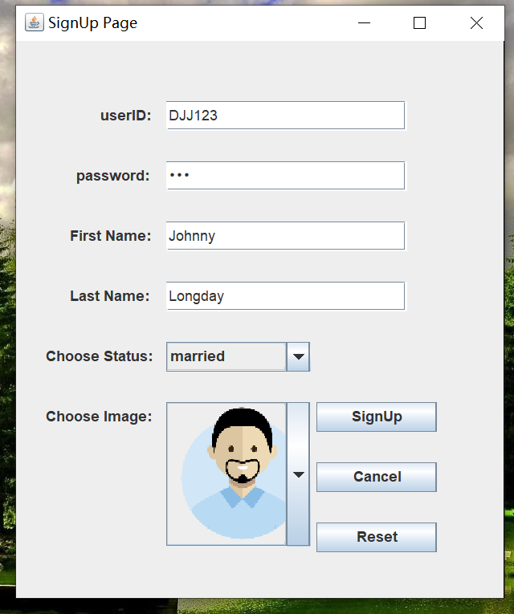
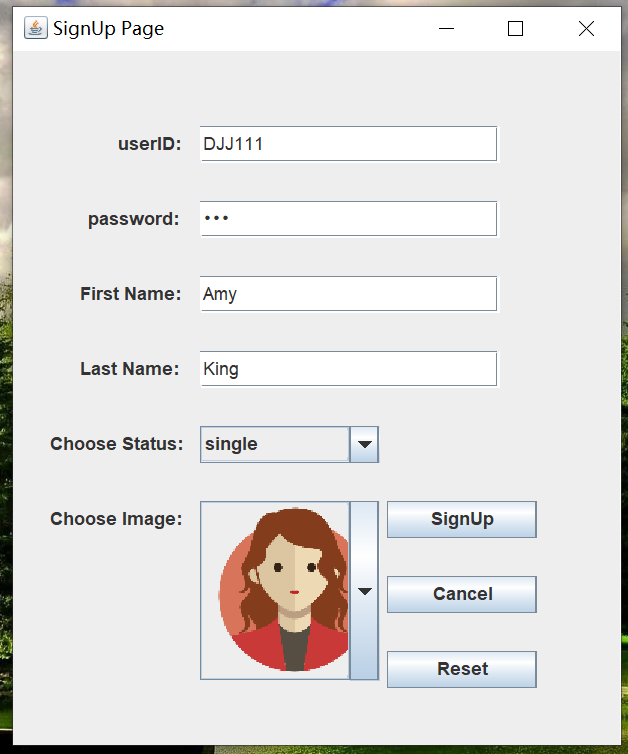
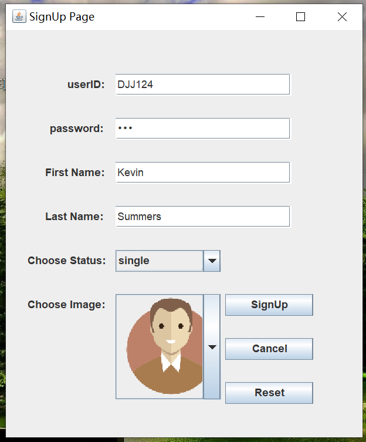
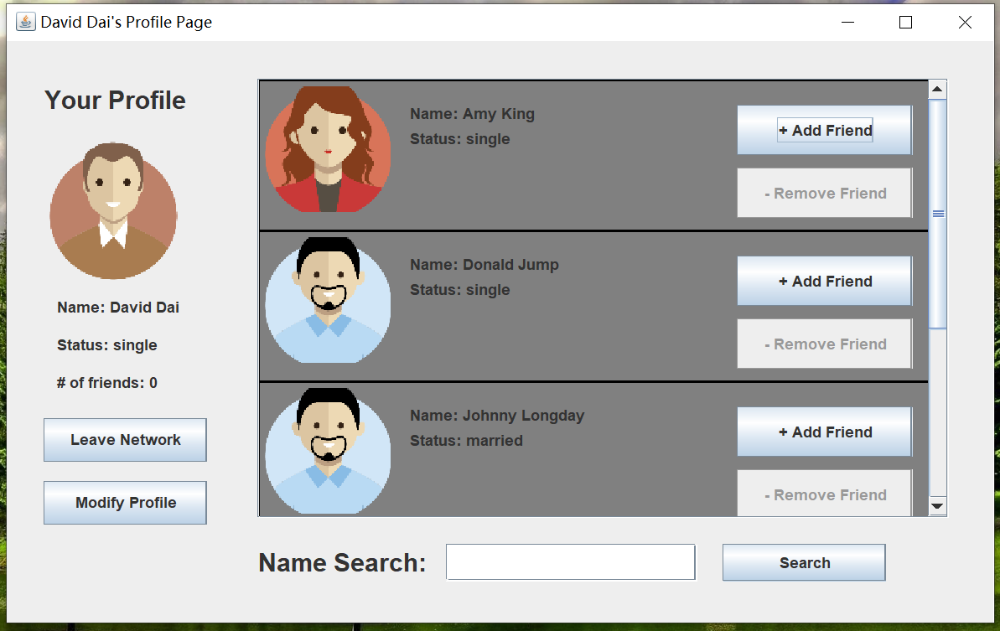
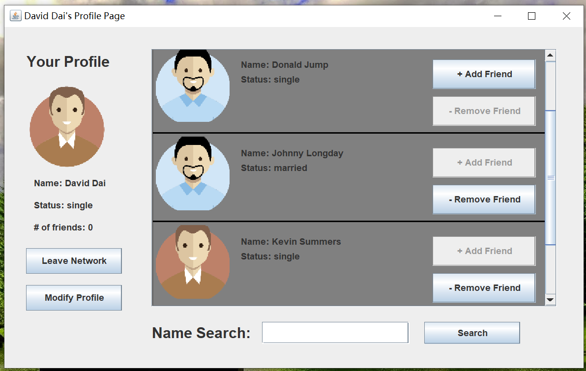
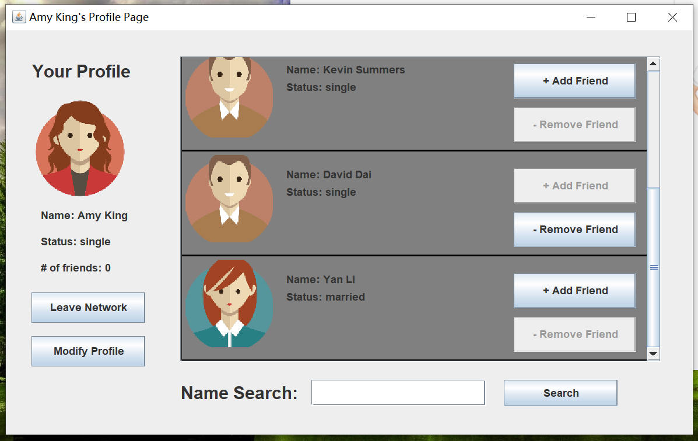
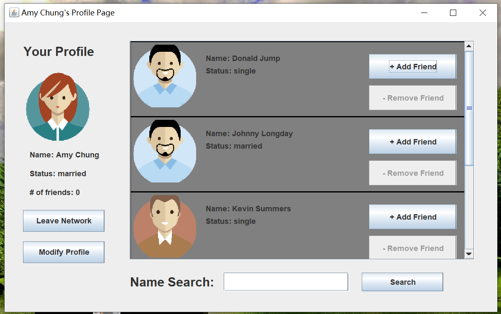

# Simple-Social-Network
This is a Jave program. This program uses an undirected graph as a ProfileManager to maintain the data of a simple social network. 
It also uses multiple HashMap to store the IDs, passwords, names, status, and profile images.
Each person in the network has a profile page that contains the person's name, profile image, current status, 
and a list of other users' profiles will be displayed in a section on the profile page. 
The Profile Manager also allows a user to join the network, leave the network, create a profile, modify the profile 
(change password, name, status, and profile image), search for other profiles, and add/remove friends.

This program involves plenty of GUI design.

There are mainly four pages a user can navigate through, they are: 1.Login Page, 2.Sign Up Page, 3.Profile Page, 4.Modification Page.
1.Login Page,

Below are images showing how this program operates:
First let's sign up a couple more users~

Now let's log into David's profile page:

By left clicking the buttons on the right of each other user, we can add them as friend:

Now let's log into Amy's profile page to see the effect:

We can click on the "Modify Profile" button to open up the modify page:

After we hit "finish", we need to leave network and then relogin to see the changes:

Challenges I am facing:
I am still trying my best to work on the function of the "Search" button, so once we type a letter and hit "Search", the system will automatically filter all users and display the one whose ID or name starting with that letter.
Overall, this project really means a lot to me, I learned lots of different technique working with GUI and design patterns.
