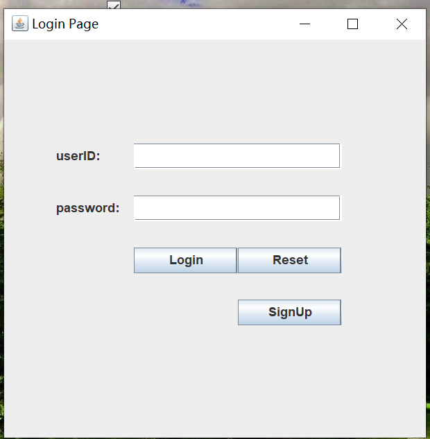
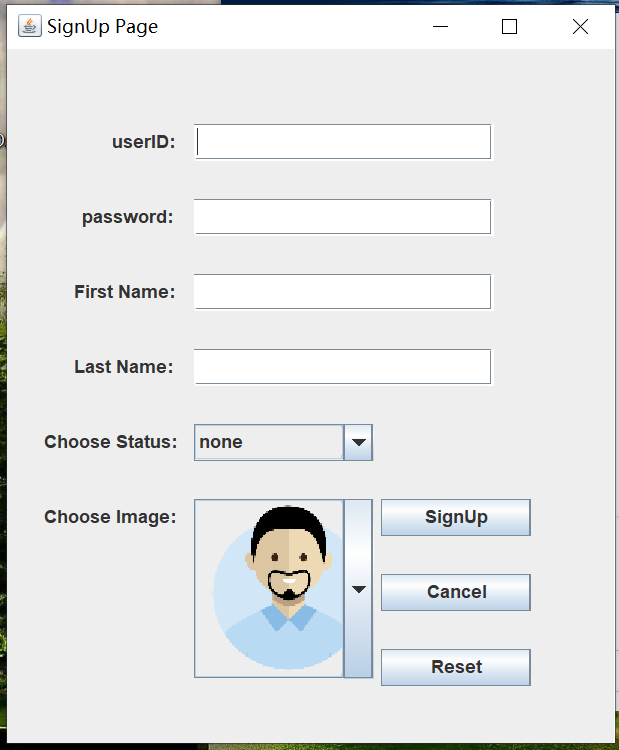
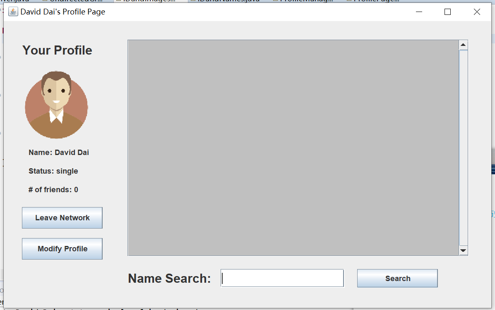
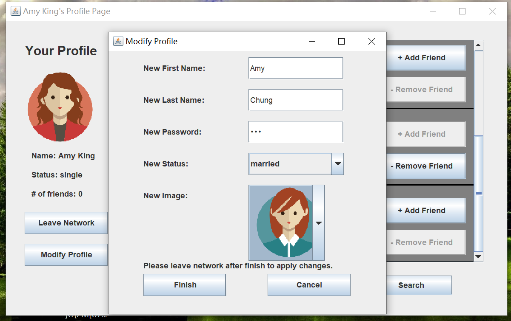

# Simple-Social-Network
This is a Jave program. This program uses an undirected graph as a ProfileManager to maintain the data of a simple social network. 
It also uses multiple HashMap to store the IDs, passwords, names, status, and profile images.
Each person in the network has a profile page that contains the person's name, profile image, current status, 
and a list of other users' profiles will be displayed in a section on the profile page. 
The Profile Manager also allows a user to join the network, leave the network, create a profile, modify the profile 
(change password, name, status, and profile image), search for other profiles, and add/remove friends.

This program involves plenty of GUI design.

There are mainly four pages a user can navigate through, they are:
1.Login Page,

2.Sign Up Page, 

3.Profile Page, 

4.Modification Page.

Below are images showing how this program operates:
